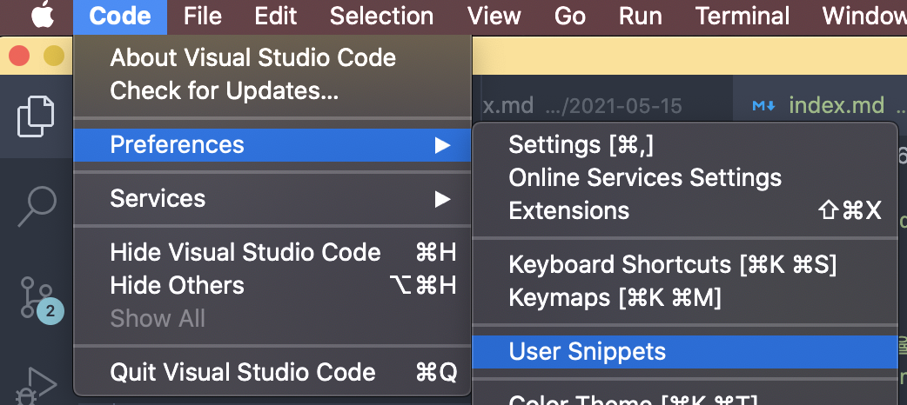
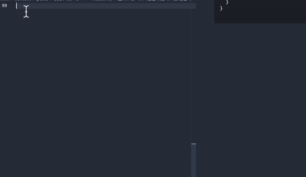
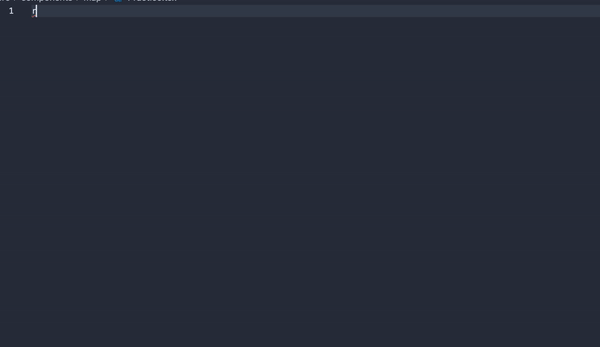

## 코드 작성 시간을 효율적으로 줄여주는 vscode의 단축키 만들기

저는 똑같은 코드를 반복해서 작성하거나, 반복적인 마우스 클릭을 싫어하는 나태지옥에 빠진 사람입니다...
그래서 취미는 단축키 외우기, 알프레드(Alfred: mac용 생산성 높여주는 앱)에 mdn, google, naver map 검색 서치 쿼리 같은 걸 만들어 두기도 하고, 새로운 프로젝트 폴더를 만들 때마다 터미널 alias도 만들어서 한 단어만 치면 바로 작업에 들어갈 수 있도록 해두는 편입니다...
그러던 중 vscode에도 단축키를 더 만들어주고 싶다는 생각이 들어 찾아보니 어렵지 않더라고요. 저와 같은 귀찮은 걸 싫어하시는 분들을 위해 소개합니다.


### 어떨 때 만들면 좋을까?

- 블로그 포스팅을 위해 똑같은 prefix를 계속 달아주어야 할 때,
- 리액트 컴포넌트 작성 시 'rsf', 'rsc'와 같은 컴포넌트 단축키 대신 스타일드 컴포넌트 까지 미리 작성 된 보일러플레이트 코드를 만들어 쓰고 싶을 때,
- for loop과 같은 단순 폼을 빠르게 작성하고 싶을 때,

등의 상황에서 유용하게 쓸 수 있습니다.😇


## 1. 작성하기

<div className="Image__Small">
  
</div>

- vscode를 열고 Code > Preferences > User Snippets를 클릭한다.
- New global snippets 파일을 만들 수도 있고, 해당 디렉토리 만의 snippets 파일을
만들 수 있는데, 나의 경우 해당 디렉토리 만의 스니펫을 만들어주었다.
- 파일명을 입력 후 엔터키를 누른다.


```json
{
	// Place your gatsby-theme-novela workspace snippets here. Each snippet is defined under a snippet name and has a scope, prefix, body and 
	// description. Add comma separated ids of the languages where the snippet is applicable in the scope field. If scope 
	// is left empty or omitted, the snippet gets applied to all languages. The prefix is what is 
	// used to trigger the snippet and the body will be expanded and inserted. Possible variables are: 
	// $1, $2 for tab stops, $0 for the final cursor position, and ${1:label}, ${2:another} for placeholders. 
	// Placeholders with the same ids are connected.
	// Example:
	// "Print to console": {
	// 	"scope": "javascript,typescript",
	// 	"prefix": "log",
	// 	"body": [
	// 		"console.log('$1');",
	// 		"$2"
	// 	],
	// 	"description": "Log output to console"
	// }
}
```

이렇게 예제 파일을 보여준다. 


## 2. 마크다운을 위한 스니펫 만들기

제 블로그는 포스트마다 정의된 형식의 prefix가 필요합니다.

```
---
title: tip | Custom VSCode Snippet 만들기
author: Positive Ko
date: 2021-05-16
hero: ./images/hero.jpeg
excerpt: 코드 작성 시간을 효율적으로 줄여주는 vscode의 단축키를 만들어봅니다.
slug: customize-vscode-snippets
---
```

이 form을 일일히 작성해주는 게 귀찮으니 스니펫으로 만들어 봅니다.


```json
{
  "BlogPost": {
    "prefix": "blog",
    "scope": "markdown",
    "body": [
      "---",
      "title: ${1:}",
      "author: Positive Ko",
      "date: 2021-${2:}-${3:}",
      "hero: ./images/hero.jpeg",
      "excerpt: ${4:}",
      "slug: ${5:}",
      "---"
    ],
    "description": "BlogPost"
  }
}

```

요렇게 작성해주기만 하면 되는데, 
- 사용 가능한 범위 지정: scope를 삭제할 경우 **모든 확장자의 파일에서 사용 가능**한 스니펫이 됩니다.
- 코드 내용 넣기: body에는 배열 안에 모든 글들을 double quote 안에 넣어주어야 하는데,
코드가 길어지면 snippet만드는 것도 귀찮아지겠쬬?🥱
[snippet generator]([https://link](https://snippet-generator.app/?description=post&tabtrigger=&snippet=&mode=vscode))를 이용하면 됩니다.
코드를 복붙해넣으면 자동으로 포맷해줍니다.
- 마우스 사용 줄이기: title을 작성하고 date를 작성하려면 마우스를 옮겨 클릭 후 다시 작성하는 게 싫으니 tab 위치를 지정해줍니다. ${1: }, ${2: } 이렇게 넘버링을 해주면 됩니다.

그럼 아래 그림처럼 사용할 수 있게 됩니다.


<div className="Image__Medium">
  
</div>

## 3. 리액트 컴포넌트 

vscode에는 이미 다양한 스니펫 익스텐션이 많습니다.
(eg. VS Code ES7 React/Redux/React-Native/JS snippets, Reactjs code snippets 이걸 사용하고 있습니다.)
그런데 여기다가 제가 쓰는 스타일드 컴포넌트까지 적용된 버전이 쓰고 싶다면, 아래와 같이 만들면 됩니다.

```json
{
  "CustomizedRsf": {
    "scope": "javascript,typescript,javascriptreact,typescriptreact",
    "prefix": "rsfs",
    "body": [
      "import styled from 'styled-components';",
      "\n",
      "function ${1:${TM_FILENAME_BASE}}() {",
      "\n",
      "return(<${1:${TM_FILENAME_BASE}}Box>",
      "\n",
      "</${1:${TM_FILENAME_BASE}}Box>)",
      "}",
      "\n",
      "export default ${1:${TM_FILENAME_BASE}};",
      "\n",
      "const ${1:${TM_FILENAME_BASE}}Box = styled.div`",
      "\n",
      "`"
    ],
    "description": "FunctionalComponentWithStyledComponent"
  }
}
```

- jsx와 tsx에 적용: javascriptreact와 같이 끝에 react를 붙이면 됩니다.
- TM_FILENAME_BASE: 파일의 이름을 그대로 받아오기 위해 사용합니다. 그러면 다음과 같이 적용할 수 있습니다.
  
<div className="Image__Medium">
  
</div>

## 4. for loop 미리 작성해두기
```json
"forloop": {
  "prefix": "forloop",
  "body": [
    "for(let ${1:i = 0}; i ${2:< 10}; ${3:i++}) {",
    "$4",
    "}"
  ],
  "description": "forloop"
}
```

이런 식으로 미리 작성해두면 매우 편합니다.


이상입니다.


