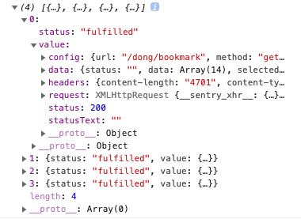

<h3> 주니어 리액트 개발자인 내가 실수하고 있었던 것</h3>

<br />

주니어 개발자 4개월차... 이대로 괜찮은가? <br />
그동안 실수했던 것들을 반성하며 회고하는 시간을 갖습니다...😶

조금은 부끄럽지만 계속 부끄러워지는 것보다 한번 부끄럽고 마는 것이 좋습니다. <br />
파편적인 지식이라 이 또한 틀릴 수도 있습니다.<br />
댓글로 틀린 내용에 대해서 말씀해주시면 5개월차 실수 모음집, 6개월차 실수 모음집을 만드는 데에 도움이 됩니다.

<br />
<br />

### 1. 이전 상태를 기반으로 새로운 상태를 세팅하기

새로운 상태는 이전 상태에 기반한 setState를 만들어서 업데이트 해야합니다. 그 이유는 setState이가 비동기적으로 작동해서 상태값을 batch(일정 시간 동안 변화하는 상태를 일괄 처리)로 변경하기 때문입니다.

`Bad👎🏻` (This can work yes, but this is not safe.)
```jsx
const [isState, setState] = useState(false);
const toggleBtn = () => setState(!isState); // (x)

return (
  <Button onClick={toggleBtn} />
)
```


`Good👍🏻` <br />
아래와 같이 작성합니다.

```jsx
const [isState, setState] = useState(false);
const toggleBtn = () => setState(isState => !isState); // (o)

return (
  <Button onClick={toggleBtn} />
)
```

이전 상태가 주어진 setState가 새로운 상태를 리턴할 수 있도록 바꾸어 줍니다. 


### 2. state 얉은 복사 

리액트에선 state의 불변성을 지켜주고 setState 함수를 통해 상태 업데이트를 해주어야 합니다. 
만약 state의 불변성을 지켜주지 않는다면 컴포넌트 렌더링이 무분별하게 일어날지도 모르고, 컴포넌트를 최적화하기 어려워지겠죠.


```javascript
const person = {
  name: 'edie',
  age: '77',
  dateJoined: '2021-05-18',
  language: {first: 'javascript', second: 'typescript'}
}

const copiedPerson = {...person};
copiedPerson.language.first = 'python';

console.log(person);
console.log(copiedPerson);

// {
//   name: 'edie',
//   age: '77',
//   dateJoined: '2021-05-18',
//   language: { first: 'python', second: 'typescript' }
// }
// {
//   name: 'edie',
//   age: '77',
//   dateJoined: '2021-05-18',
//   language: { first: 'python', second: 'typescript' }
// }
```

person의 langauge.first가 python으로 바뀐 것이 보이시죠.
이럴 땐 다음과 같이 바꾸어야 합니다.

```javascript
const copiedPerson = {...person};
copiedPerson.language = {...person.language, first: 'python'};

console.log(person);
console.log(copiedPerson);

// {
//   name: 'edie',
//   age: '77',
//   dateJoined: '2021-05-18',
//   language: { first: 'javascript', second: 'typescript' }
// }
// {
//   name: 'edie',
//   age: '77',
//   dateJoined: '2021-05-18',
//   language: { first: 'python', second: 'typescript' }
// }
```

위처럼 참조 데이터 안에 또 다른 참조 데이터가 있을 땐, 그 분기점마다 스프레드 연산자를 사용해야 합니다.
혹은 데이터 구조가 좀 더 복잡해진다면 `Immer.js`의 `produce` 함수를 사용해서 상태의 불변성을 지키며 업데이트할 수도 있습니다.


### 3. ?? Nullish Coalescing과 || OR operator

흔히 value가 `undefined`나 `null`인 경우를 알기 위해 OR operator를 많이 씁니다.

```javascript
const value = undefined;
console.log(value || 1); // 1
console.log(value ?? 1); // 1

const value1 = null;
console.log(value1 || 1); // 1
console.log(value1 ?? 1); // 1
```

이처럼 OR operator(||)는 좌측이 false인 경우, 우측의 값을 리턴합니다.
그런데 undefined도 false이고 null도 false이지만, **0 또한 false이고 '' 또한 false**입니다.
따라서 값에 0이나 ''가 들어올 수도 있는 경우 다음처럼 ||와 ??를 구분해서 사용해야 합니다.

```javascript
const value2 = 0;
console.log(value2 || 1); // 1
console.log(value2 ?? 1); // 0

const value3 = '';
console.log(value3 || null); // null
console.log(value3 ?? null); // ''
```

이처럼 Nullish coalescing operator(??)는 좌측이 undefined인 경우에만 우측의 값을 리턴하고, 그 외에 경우에는 그대로 리턴합니다.


### 4. JSON mock data 만들기

JSON Mock data를 만들 때, 일일히 double quote를 치고 있던 제 모습이 기억납니다.
그냥 JSON.stringify()를 쓰면 되는 걸...

```javascript
const person = {
  name: 'edie',
  age: '77',
  dateJoined: '2021-05-18',
  language: 'javascript'
}

// JSON.stringify(value, replacer, space)
JSON.stringify(person, null, 2);

// '{
//   "name": "edie",
//   "age": "77",
//   "dateJoined": "2021-05-18",
//   "language": "javascript"
// }'
```

### 5. 컴포넌트에 boolean props true 표시 X, string props 브라켓 X

컴포넌트에 전달하는 boolean props가 true일 때에는 따로 true를 표시하지 않습니다. string props는 컬리 브라켓을 쓸 필요 없이 double quote로만 전달합니다.

```jsx
<Components disabled={true} /> // (x)
<Components disabled /> // (o)

<Components title={"제목"} /> // (x)
<Components title={'제목'} /> // (x)
<Components title={`제목`} /> // (x)
<Components title="제목" /> // (o)
```
자세한 내용은 [Airbnb React/JSX Style Guide](https://github.com/airbnb/javascript/blob/master/react/README.md)를 참고합니다.

### 6. 여러 API 동시에 완료시키기

한 개의 컴포넌트 안에서 여러개의 API를 연결해야 하는 상황이라면 첫 번째의 response와 마지막 열두 번째의 response까지 텀이 발생해서 순차적으로 view가 뜨는 문제가 발생할 수 있습니다.
한 번에 12개의 API를 연결해야하는 컴포넌트에서 모든 view를 한꺼번에 띄울 수 없을까 고민하다가 사용하게 된 것은 Promise.all과 Promise.allSettled이었습니다.

Promise.all, Promise.allSettled 둘 다 모두 array 안에 있는 모든 request가 resolved 되면 결과를 return합니다. 차이점은 Promise.all은 중간에 하나의 request가 rejected 되면 모든 request의 실행이 중단되고 다음의 request는 실행되지 않지만, Promise.allSettled는 하나가 rejected 되더라도 모든 request가 실행되고 결과를 return한다는 점입니다.

따라서 용도와 목적에 따라 all과 allSettled를 구분하여 사용하면 됩니다.


```javascript
  const axiosBookmark = async () => {
    const sendingUrls = [
      getDongBookmark(),
      getLegalDongBookmark(),
      getKakaoBookmark(),
      getHospitalBookmark(),
    ];

    const response = await Promise.allSettled(sendingUrls);

    console.log(response);
  };

  useEffect(() => {
    axiosBookmark();
  }, []);
```

다음과 같은 결과가 리턴됩니다.
<div className="Image__Small">
  
</div>

각각의 request가 `fullfilled` 혹은 `rejected`되었는지를 알려주고 그에 따른 결과 data를 얻을 수 있습니다.


### 7.. 네스팅하지 않고 early return 하기
```jsx
function PracticeComponent() {
  const [isLoading, setLoading] = useState();

  return (
    <>
      {isLoading ? (
        <Spin />
      ) : (
        <PracticeBox>
          <p>Title</p>
          <span>contents</span>
        </PracticeBox>
      )}
    </>
  );
}

export default PracticeComponent;
```

위처럼 삼항 연산자로 쓰는 경우가 많았습니다. 하지만 다음처럼 네스팅하지 않고 얼리 리턴해버리면 더 코드가 깔끔해 보입니다.

```jsx
function PracticeComponent() {
  const [isLoading, setLoading] = useState();

  if (isLoading) return <Spin />;

  return (
    <PracticeBox>
      <p>Title</p>
      <span>contents</span>
    </PracticeBox>
  );
}

export default PracticeComponent;
```


### 마무리
정리한 실수는 여기까지 입니다. <br />
이보다 더 많은 실수들이 있지만 내용을 보다 더 자세하게 담고 싶은 생각에 다른 포스트로 업데이트를 해보려합니다.
읽어주셔서 감사합니다😇


