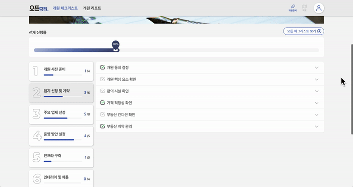
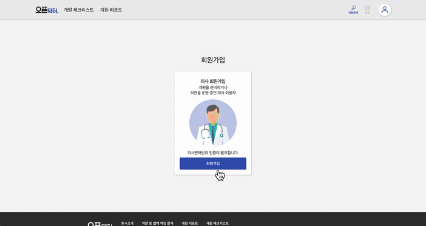

_이 글을 이 세상의 모든 사수가 없는 신입 개발자 분들께 바칩니다.. ^^b_

# 0. 시작

저는 오픈닥터의 유일한 프론트엔드 개발자입니다. 작년 10월 본격적으로 프론트엔드 개발 공부를 시작했고, 작년 12월 한 달간 오픈닥터라는 신생 스타트업에서 인턴을 하던 중 올해 1월 말에 감사하게도 채용 오퍼를 받아 근무하고 있습니다😇

처음에는 용기가 부족했습니다. 시니어 개발자 없이 주니어 혼자 개발을 해야한다는 것이... 하지만 한편으로는 정말 큰 기회라는 생각이 들었어요. 혼자 기획 단계에서부터 출발해 개발-배포-운영에 이르는 모든 것을 다 해보고 싶다는 욕심이 있었고, 저 혼자 어디까지 만들 수 있을지 너무 궁금했습니다. 

갓 태어난 신입 개발자라 지금 굉장히 코며들고 있는데…! 이걸 해보면 내가 정말 개발을 좋아하는지, 열의가 있는지 리얼하게 알 수 있을 것 같았습니다. 

이렇게 1월 18일 오픈닥터의 프론트엔드 개발자로서 커리어를 시작합니다🙏🏻

 

---

# 1.소개

오픈닥터는 '의사들이 진료에만 집중할 수 있게 만들자'라는 방향성을 가지고 의사 및 전략 컨설턴트 주도로 모인 팀입니다. 저희가 첫 번째로 시작한 프로젝트는 '의사들의 개원을 돕는 서비스'를 만드는 것이었어요. 오픈닥터 홈페이지는 개원을 앞둔 의사들이 이용할 수 있는 <u>개원 관리 툴</u>입니다. 

## 1) 🗺 지도 페이지

지역별 의원 정보를 제공합니다. 데이터 사이언티스트분이 모은 전국의 52,000여 개의 의원-병원 정보와 다양한 데이터를 바탕으로 **개원 매력도**를 제공하고 있습니다. 

  

지도 페이지는 프론트 3개월차 신입에게 가장 큰 난관이었습니다. 두 개의 난제는 리액트의 라이프사이클과 상태 관리에 카카오맵을 최대한 자연스럽게 얹는 문제, 리액트 컴포넌트를 자바스크립트 SDK인 카카오맵에 어떻게 연결할지에 대한 부분이었습니다. 

처음에는 지도에 마커를 어떻게 띄워야 하는지도 몰랐을 정도로 리액트에 대한 이해도도 많이 부족했고 반응형 지도를 다루는 것이 정말 미숙했습니다. 
그 과정에서 리액트의 상태 관리와 여러 훅을 깊게 고민해는 기회가 되었습니다. 특히 카카오맵에 대해선 [카카오 개발자 포럼](https://devtalk.kakao.com/c/map-api)의 거의 모든 글을 읽으며 많은 정보를 얻을 수 있었습니다. (카카오 개발자 포럼의 doji.doo님의 글 👍🏻👍🏻)   

제일 재밌고 제일 챌린징했으며 앞으로 개선하고 싶은 게 가장 많은 페이지입니다.🥺  

### 🏷 두 개의 탭

진료과 및 전문의 필터링

  

지도를 기반으로 받아오는 데이터들을 어떻게 하면 두 개의 탭까지 효율적으로 가져올 수 있을까 고민하며 디렉토리 구조와 컴포넌트의 구조의 설계를 고심했던 부분이었습니다. 

탭과 지도는 한 몸이어야 하는데 자꾸 따로 놀려고 하기에🥲 어르고 달래서 지금의 오픈닥터의 중추가 되었습니다. 
앞으로 계속 개선시켜서 사용성이 좋은 탭을 만들고 싶어요. 

### 🔎 행정동 자세히 보기

최대 21개의 그래프로 행정동의 디테일한 정보를 담았습니다.

  

21개의 그래프를 각기 다른 유형으로 시각화시키는 작업에서 가장 중점적으로 두었던 부분은, 백엔드와의 소통 그리고 재사용성이 높은 모듈의 작성입니다. 

어떻게 하면 모듈화를 더 빠르고 효용성 높게 작성할 수 있는지, 어디까지 모듈화를 해야 하는지, 많은 데이터를 어떠한 데이터 스키마로 어떻게 콜해서 어떻게 업데이트할지에 대해 고민할 수 있는 기회였습니다. 

### 📍 행정동 비교하기

행정동 및 진료과 별로 도출한 점수를 한 곳에서 볼 수 있습니다.

  

유저가 개원하고 싶은 행정동을 모아 한 곳에서 볼 수 있도록 합니다. 더 편하게 비교하고 한 눈에 파악할 수 있도록 발전시켜야 할 부분이 많은 요소입니다.

### 🧐 검색

행정동, 의원, 장소, 주소 검색

  

카카오 검색 api와 백엔드 api를 동시에 콜하면서 어떻게하면 효율적으로 서버와 연결할 수 있을까에 대해 고민했던 부분입니다. 

이렇게 해도.. 되는 건가..😭? 라는 생각이 자꾸만 들면서 여러 명의 개발자 분들께 조언을 얻기도 했던 기능입니다. 집단지성으로 무사히 구현했지만, 한편으론 앞으로 고도화시켜야 할 부분이 많고 욕심이 나는 기능이기도 합니다. 

### 📌 내 장소 저장

폴더링 및 메모 추가 기능

  

처음에는 간단한 즐겨찾기 방식이었으나 베타테스트 중 테스터의 FB를 거쳐 폴더링 및 메모 기능이 추가되었습니다. 

꽤 간단해보여서 금방 끝낼 것이라고 생각했는데 이미 많은 기능 개발을 끝내놓은 상황에서 미리 설계했던 구조를 많이 뜯어내야 했기에 목표로 했던 기간보다 3일이 더 소요됐습니다. 

유지 보수를 위한 코드, 확장성 있는 코드가 이래서 필요하다는 것을 몸소 체험했고, 제 무식했던 지난 날을 반성하며.. 이게 바로 코딩인가를 조금이나마 경험했습니다. 저는 갈 길이 머네요. 

### 🚶 로드뷰

  

비교적 최근에 구현했던 기능이고, 카카오맵 api에 적응된 덕분인지 상대적으로 빠르게 구현할 수 있었습니다. 

로드뷰 기능을 추가해달라라는 요청에 디자인에서부터 작은 로드뷰와 전체 로드뷰의 로직을 나누어 구상했습니다. 유저가 어떻게 하면 로드뷰를 편하게 볼 수 있을까 고민하며 내가 유저라면 이렇게 만들겠다고 생각했던 기능들을 추가했습니다. 

요즘은 이 로드뷰를 코딩이 잘 안 풀릴 때 제주도 성산일출봉 보러 가는 데 씁니다^^b

### 🔥 요즘 뜨는 동네

점수를 조정해 높은 점수의 행정동을 진한색으로 표시합니다.

  

슬라이더로 점수를 조절하면 진한 색으로 표시해줍니다. 초기에는 모든 행정동 마커들이 한 가지 색상이었는데, 3가지 색상으로 바뀌면서 가시성이 좋아졌습니다. 

## 2) 📝 개원 체크리스트

  

개원을 위해 거쳐야하는 과정을 8단계로 구분해 체크 및 기록하고 바로 프린트할 수 있습니다.

## 3) 📕 개원 리포트

  

개원에 필요한 정보를 리포트 형식으로 제공하는 게시판입니다.

## 4) 👩 회원가입 및 마이페이지

  

빠른 가입을 위해 자동완성 기능을 추가했습니다.

---

# 2. 어떻게 개발했나?

  

### 🥁 先생각 後타이핑
많은 기능을 빠른 시간 내에 구현해야 했기 때문에, 정해진 기간 내에 보다 실수 없이 만들어 내기 위해 코드 작성 전 로직을 정리하는 걸 중요하게 생각했어요.
실제로 이렇게 메모장에 생각을 미리 정리하며 케이스를 구분 짓고 예외 처리까지 정리한 후 진행했던 게 가장 큰 도움이 되었습니다.
예를 들어 <u>**로드뷰 기능**</u>을 구현한다고 했을 때,

- **로드뷰의 레이아웃?** 우측 하단에 작은 로드뷰, 전체 화면 로드뷰 2가지 방식으로 보여주자!
- **우측 하단의 작은 로드뷰?** 작은 로드뷰의 디폴트 크기를 정해놓되, 로드뷰의 크기를 유저가 드래그해서 조정할 수 있도록 해주자(전체 뷰포트의 padding 30px 범위까지). 맵 워커의 이동에 따라 로드뷰가 바뀌지만 지도의 중심위치는 바뀌지 않게 해서 반응형 지도의 데이터 로드를 줄여주자. 로드뷰 상에서 위치 이동 시 지도는 고정하되 맵워커는 이동. 지도 클릭 시 로드뷰 데이터가 없을 경우 가장 최단 거리의 로드뷰 데이터가 있는 좌표로 맵 워커를 이동시키자  (...)
- **전체 화면 로드뷰?** 로드뷰 안에 작은 지도를 추가하고 맵 워커 이동에 따라 지도의 중심위치를 바꾸어 주자. 전체 화면 모드 종료 후 `로드뷰의 좌표 === 지도의 중심위치`  (...)

세세한 기능 구현 사항을 미리 정해두고 글을 그대로 코드로 옮겼더니 비교적 빠른 시간 내에 구현할 수 있었습니다. 

### 🎬 문제 발생 시 떠오르는 여러 해결책을 나열해보고 적용해보기
예를 들어 Map에 있는 마커 위에 마우스를 오버했을 때 나타나는 모달이 있는데, 이 마커가 지도 가장자리에 있을 때에는 모달이 창 밖으로 떠버리는 문제가 있다고 합시다. 
그러면 먼저 아이디어를 생각했어요.
- **아이디어**: 'viewport 기준으로 modal 크기 이상으로 mouse 포인터가 위치할 경우 modal의 위치가 더이상 나가지 않도록 조정하는 formatter를 넣어주자'
- **어떻게**:
	먼저 포인터의 위치를 가져오는 방법은 두 가지를 시도해볼 수 있겠는데,
	1) modal 생성 후 useEffect로 addEventlistener mousemove 실행. modal 생성 삭제는 map의 마커에서 관리 (...)
    2) map의 마커에 mouseEnter 했을 때 addEventlistener 실행하고 mouseleave 하면서 함수 종료하기 (...)
    -> 2번 먼저 시도해보자!
- **실행**: 화면을 4분면으로 나눠서 각각의 면에서 모달의 위치를 바꾸어주는 수식을 다르게 적용하는 formatter 함수를 만들자. (...) 이걸로 `const markerLocation = {xAnchor: xFormatter(...), yAnchor: yFormatter(...)}` 요런 식으로 어쩌구 저쩌구 (...)

### 🏆 우선순위 정하고 무조건 중요한 것부터

백엔드 개발자와 PM과 끊임없이 커뮤니케이션하면서 정한 우선순위를 바탕으로 업무를 처리했어요. 하나의 기능이 아닌, 홈페이지 전체를 맡았기 때문에 구현해야 하는 기능이 많았고 우선순위에 따른 업무 진행이 필수적이었습니다.
백엔드분과 api 작업 실행 순서와 가장 효율적으로 작업을 마칠 수 있는 데이터 스키마에 대해서 지속해서 이야기를 나누었습니다.
그리고 PM분과 전체적, 부분적인 작업 실행 상황과 일정에 영향을 주는 변수라든지, 세부적인 구현 사항에 대해서 세세하게 커뮤니케이션했습니다. 
많은 커뮤니케이션으로 세부 일정을 계속 조정해나가면서 개발했던 것이 코딩하는 것만큼이나 중요했다고 생각합니다.
 

---

# 3. 배운 점

- 유지와 보수를 생각하는 더 넓은 시야로 코드를 작성한다.
- 코드의 의존성을 낮추고 하나의 레이어에 많은 기능을 부여하지 않는 코드 작성하기.
- 일정을 고려해 일단 굴러가게 만든다. 그리고 점점 더 잘 굴러가게 만든다.
- 리팩토링은 다 끝내고 하는 게 아니라 그냥 매일 하는 것. 클린 코드 공부하자!
- 최적화는 매우 비싼 놈이라서.. 집착하고 시간을 투자하지 않으면 쉽게 얻을 수 없다. 
- 자동화, 디버깅, 트러블슈팅은 앞으로 더 공부해야 됨.

 

---

# 4. 아쉬운 점

- 와 정말 많이 만들었네 뿌듯하다가도 눈 감았다 뜨면 항상 아쉽다.. 더 멋지고 튼튼한 프로덕트를 만들고 싶다
- 개발은 코딩의 범위를 넘어서 비즈니스에 대한 문제를 해결하는 것이라는 것을 it G ma..
- 테스트 코드 작성 못 한 것.. (E2E를 꼭 작성해보고 싶다)
- 보수적으로 스택을 정한 것 (새로운 스택을 도입하면 일정을 맞추지 못할 것이라는 걱정으로 소극적인 선택을 했다)

 

---

# 5. 제작 상세

`주소`: https://opndoctor.com
정말 아쉽지만 데스크탑에 최적화되어 있고 아직 모바일 버전은 제공되지 않습니다 (죄송합니다🥲 열심히 준비하겠습니다)

`제작 기간`: Total 약 4개월 (110일)

2월 18일 깃 레포지토리 생성.
3월 18일 베타버전 배포 및 베타 테스트 시작.
6월 7일 런칭🎉

`스택`: React (ver 17.0.1) / JavaScript / TypeScript (ver 4.1.2) / Redux / Styled Components

`기타 라이브러리 및 협업 툴`

- 이용 서비스 및 주요 라이브러리: Kakao map api / Kakao search api / Antd / Lodash / Recharts
- 배포: AWS S3 / cloudfront
- 협업툴: Figma / Trello / Github
- 에러 관리: Sentry

 

---

# 6. 마치며

결코 쉽지 않았던 4개월간의 개발을 마치고 런칭을 하게 되었습니다.
혼자 a부터 z까지 도맡아 했던 건 정말 귀중한 시간이었고, 무척 힘들었던 시간이었습니다.
항상 내가 치는 이 코드가 맞을까..? 라는 물음이 가득했지만 회사에 프론트는 저 뿐이었기 때문에 오로지 스스로 알아내는 수밖에 없었어요.

미디엄, 스택오버플로우와 온갖 개발자 블로그를 매일 들여다보았고, 2개의 스터디를 추가로 진행하며 문제에 대해 조언을 얻고 서로 의견을 나눠가며 방법을 터득해나갔어요. 
그 과정에서 개발자로서 지식을 공유하는 일이 다른 사람에게 얼마나 도움이 되는 일인지 깨닫게 되었고,
이 글 또한 그런 연유에서 쓰게 되었습니다.

사수가 없는 회사에서 근무를 한다는 것이 최적의 상황은 절대 아니고, 대부분의 사람들은 절대 가면 안된다라고 할지는 모르겠지만 저에게는 적어도 인생의 큰 변곡점이 되었거든요.
누군가가 신입으로 사수가 없는 곳에서 근무하겠다고 한다면 저는 응원하겠습니다. 모든 걸 혼자 다 할 수 있어야 하고, 누구에게도 일을 떠넘길 수 없는 극한의 상황에서😇 더 무거운 책임감을 가지고 강하게 자랄 수 있다는 장점이 있습니다..^^ (물론 심적으로 부담이 되고 스트레스를 받을 때도 있었지만, 그럴 땐 그냥 나는 코딩하는 기계다..라고 생각하며 극복하면.. ^^7)

아직 결코 자랑이 되지 않는 실력을 갖추고 있지만, 이 회고를 발판삼아 권태에 빠지지 않고 계속 탄탄한 서비스 만들어나가겠습니다.
작은 것들을 꾸준히 자랑으로 삼아 그 작은 것들의 총합이 절대 가볍지 않은 개발자의 삶을 살고 싶습니다.

끝까지 읽어주셔서 감사합니다!

 
 
 
 
