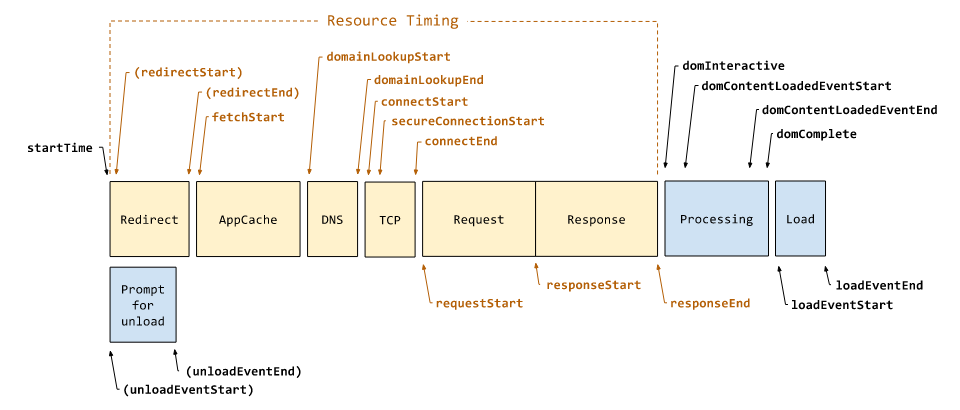
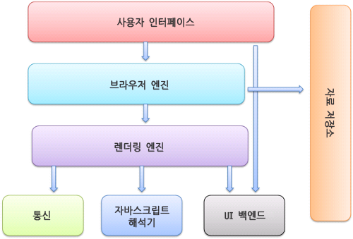

## 웹 페이지 로드 과정

브라우저가 웹 페이지 파일을 파싱해서 DOM 트리를 그리고 렌더링하는 과정을 거치기 전에 먼저 보다 전체적인 과정을 살펴봅니다.

현재 페이지에서 주소창에 주소를 입력하여 다른 페이지로 이동하는 과정을 정리하면 다음과 같습니다.

  

- **Prompt for unload**
  다른 페이지로 이동할 때 발생하는 이벤트입니다.
  이 단계에서 `beforeunload` 이벤트를 이용해 "이 페이지를 벗어나시겠습니까?"와 같은 Alert을 사용할 수 있습니다.
- **Redirect**
  리디렉션 신호가 있다면 서버에서 해당 URL로 HTTP 요청을 보냅니다.
- **AppCache**
  실제 서버에서 데이터를 받아오기 전에 브라우저 캐시에 저장된 데이터가 있는지 확인하는 단계입니다. 이미 캐싱된 데이터가 있다면 네트워크 통신을 하지 않고 바로 사용하여 효율을 높입니다.
- **DNS**
  도메인명에서 IP 주소를 조회해 실제 HTML 파일 등의 리소스를 가지고 있는 서버의 IP 주소로 변환해주는 역할을 합니다.
- **TCP**
  DNS 단계에서 알아낸 IP주소와 포트번호로 클라이언트와 서버 사이에 TCP 커넥션을 맺습니다.
- **Request / Response**
  TCP 커넥션이 성공적으로 맺어지면 웹브라우저는 서버에 HTTP 요청을 보내고, 서버는 웹브라우저에 HTTP 응답을 돌려줍니다.

여기까지는 네트워크 레벨에서 일어나는 과정으로 주로 백엔드가 담당하게 됩니다. 다음의 Processing 과정에서부터 렌더링이 시작됩니다.

- **Processing**
  HTTP 응답으로 받아온 HTML, JS, CSS, image 파일 등을 파싱하고 렌더링합니다. 브라우저가 해석하도록 DOM tree를 만드는 단계입니다. - domInteractive: 모든 HTML 및 DOM 생성 작업이 완료 - domContentLoadedEvent: DOM 및 CSSDOM이 모두 준비된 시점으로 렌더링 트리가 생성되기 전 단계. 여기서 JavaScript 기능 추가. - domComplete: 페이지 및 해당 하위 리소스가 모두 준비된 시점
- **Load**
  렌더링이 마무리되면 브라우저는 다운로드한 파일들을 사용자가 볼 수 있는 상태로 화면에 띄웁니다.

## 웹 브라우저 기본 구조

웹 브라우저는 아래와 같이 구성되며 렌더링 엔진에서 웹페이지를 표현하는 렌더링이 일어납니다.

  

## 렌더링 엔진의 동작 과정

### 1) HTML, CSS, JS 파싱
HTML 데이터를 받게 되면 브라우저의 메인 스레드가 HTML의 문법을 분석하고 코드를 이해하며 DOM으로 파싱합니다. 하지만 `script`태그를 만나면 JavaScript를 해석할 때까지 파싱을 멈춥니다. ( ∵ JavaScript는 `document.write()`으로 문서의 구성을 바꿀 수 있기 때문. → 자바스크립트 코드를 비동기적으로 로드해서 파싱을 막지 않을 수도 있다!)

### 2) DOM, CSSOM 변환
브라우저에서 사용할 수 있는 객체적 구조로 변환합니다.

### 3) 렌더 트리 구축
DOM과 CSSOM을 결합하여 화면에 그려낼 내용을 작성합니다.

### 4) 레이아웃: 렌더 트리 배치
메인 스레드는 DOM과 각 요소의 크기와 위치를 계산하고 레이아웃 트리를 생성합니다. 레이아웃 트리는 DOM 트리와 유사할 수 있으나 페이지에 보이는 정보만을 담고 있습니다.

### 5) 렌더 트리 페인팅
요소를 실제로 픽셀로 변환하여 그리는 `레스터라이징`과 한 페이지의 부분들을 여러 레이어로 나눠 각각 레스터하며 컴포지터 스레드에서 페이지를 합성하는 `컴포지팅`이 일어납니다.
여기서 컴포지터 스레드는 메인스레드와는 다른 스레드이기 때문에 자바스크립트의 연산을 기다릴 필요 없이 실행됩니다. 따라서 성능을 위해서는 컴포지팅만 하는 애니메이션(eg. opacity, translate, rotate, scale)을 사용하는 것이 좋습니다.
이 모든 과정은 **점진적**으로 일어나기 때문에 하나의 단계가 완벽히 끝나지 않아도 어느 정도 읽으면 객체로 변환해서 그려내기를 반복합니다.

### 참고자료

- [[Browser] 웹 페이지 로드 과정](https://yeoulcoding.tistory.com/167)
- [Navigation Timing Level 2](https://www.w3.org/TR/2021/WD-navigation-timing-2-20210927/#sec-navigation-timing)
- [NAVER D2](https://d2.naver.com/helloworld/59361)
- [모던 웹 브라우저 들여다보기 (파트 1) | Web | Google Developers](https://developers.google.com/web/updates/2018/09/inside-browser-part1?hl=ko)
- [[웹개발] 브라우저의 작동 원리](https://it-ist.tistory.com/110)
