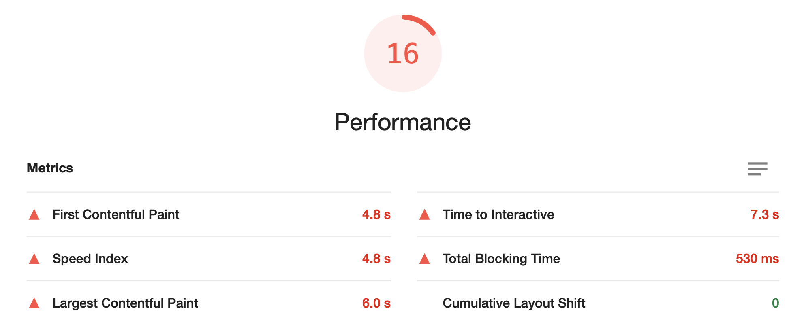

네 정말 아무것도 몰랐습니다.
제가 신입 개발자로 커리어를 시작하면서 피땀눈물로 만든 지도 사이트의 성능이 .. 이렇게 좋지 않을 줄은 저도 몰랐어요. ㅇ<-< ...<br />
정말 아~무것도 몰랐던 신입 개발자가 라이트하우스로 퍼포먼스 점수 30점을 올렸던 경험담을 소개합니다.
참고로 라이트하우스 점수는 4가지 기준으로 산정됩니다. `Performance`, `Accessibility`, `Best Practice`, `SEO`.
이 글은 `Performance` 개선 과정에 대해서만 다루도록 하겠습니다.

# 1. 라이트하우스를 도입하게 된 이유

올해 2월부터 만들기 시작한 지도 서비스를 6월에 정식으로 런칭하고서 숨가쁘게 달려온 4개월을 반추하는데,
스스로 자랑스럽다기보다는 이제까지 그냥 '동작'하는 코드를 작성했을 뿐이라는 불안감이 가득했습니다. <br />
사수 없이 혼자서 프론트엔드를 도맡아 작성한 이 코드가 '옳은 것'이었을지, 잘못되었다면 어떤 부분일지 조언을 얻을 곳도 마땅치 않았어요.<br />
더불어 저에겐 `'더 빠르고 성능이 좋은' 서비스에 대한 욕심`이 있었습니다. 더 나은 사용자 경험을 제공하고 싶었어요.<br />
그리고 앞으로 계속 이 서비스를 꾸준히 개선하기 위해서는 `객관적으로 수치화된 목표가 절실`하다는 생각이 들었습니다.
이러한 이유로... 런칭 후 본격적으로 라이트하우스 점수를 이용하기 시작했습니다.

# 2. 현상 파악

런칭했을 때 라이트하우스 Performance 점수는 24점이었습니다. 하지만 점점 기능이 추가되고 코드가 쌓이면서 최저 16점까지 하락했습니다.
그때부터 1점, 2점씩 올리는 것으로 목표를 세웠습니다.

<div className='Image__Small'>
  
</div>

제가 만든 사이트는 지도 기반의 서비스입니다.
지도는 마우스 드래그를 1mm만 움직이더라도 새로운 지역의 타일 이미지와, 지도 위에 띄울 오버레이 및 마커 데이터를 계산해 새롭게 로드합니다.
따라서 레퍼런스를 얻기 위해 다른 지도 사이트는 라이트하우스가 몇 점일지 측정해보았습니다.

직방 39점, 마이프차 20점, 호갱노노 54점, 카카오맵 53점, 네이버지도 94점이었습니다.
(device Desktop / 21.10.20 기준 / 지도 중앙 위치 정자역 부근)<br />
참고로 위의 점수는 많은 변수에 의해 영향을 받습니다. 사용자의 컴퓨터 성능 혹은 CPU 작업량, 지도의 위치에 따라 로드하는 데이터의 양.. <br />
특히 카카오맵과 네이버지도의 경우, 다른 사이트와는 달리 마커 데이터를 먼저 불러오지 않습니다. 검색을 해야 검색 쿼리에 해당하는 마커 데이터를 불러오는 방식입니다.
따라서 검사할 때 이를 유의해서 체크해야하며, 최대한 여러번 라이트하우스를 실행하여 오차범위를 체크하는 것이 좋습니다.

라이트하우스에서는 다음과 같은 요소로도 점수가 변동할 수 있다고 설명합니다.

- A/B tests or changes in ads being served
- Internet traffic routing changes
- Testing on different devices, such as a high-performance desktop and a low-performance laptop
- Browser extensions that inject JavaScript and add/modify network requests
- Antivirus software

# 3. 주요 과정

### 1) data fetching 방식 변경

> 웹 사이트의 성능 = 시간 + 리소스

웹 사이트의 성능은 시간과 리소스를 기준으로 평가할 수 있습니다. 적은 리소스를 사용하면서도 빠른 시간 내에 실행된다면 보다 좋은 성능이라고 말할 수 있겠죠..
제가 성능 개선을 위해 먼저 했던 일은 사이트가 이용하는 리소스를 최대한으로 줄이는 것이었습니다.
당시 렌더링에 따른 불필요한 API 콜이 발생하고 있었는데, useCallback 혹은 debounce로 이벤트를 줄여도 최소 1번의 중복 요청이 발생했습니다.
이를 해결하기 위해 필요한 요청만 할 수 있도록 Redux Saga의 [takeLatest](https://redux-saga.js.org/docs/api/#takelatestpattern-saga-args) 메소드 혹은 [React Query](https://react-query.tanstack.com/) 도입 중에서 고민하던 중,
최종적으로 React Query를 도입하기로 결정했습니다. <br />
그 이유는 1) 그동안 사용하던 리덕스의 의존도를 낮추고 싶었고 2) 리액트 쿼리의 캐싱 기능으로 기존 리덕스에서 주기적으로 데이터를 리패치해주어야 하는 불편함을 줄일 수 있다고 판단했기 때문입니다.
이를 도입하면서 데이터 캐싱으로 서버 데이터를 중복 호출하지 않으면서도 setState의 횟수를 줄였고, dispatch 사용을 줄이며 Redux 의존도를 낮출 수 있었습니다.
또한 [Total Blocking Time](https://web.dev/tbt/)을 530ms에서 140ms로 줄이면서 유저의 action에 더 빠르게 반응할 수 있도록 개선할 수 있었습니다.

<emphasizing>
  💡 <strong>TBT란?</strong> <br />
  FCP(First Contentful Paint)와 TTI(Time to Interactive) 사이 총 시간을 의미합니다.
  메인 스레드에서 실행 시간이 긴 작업(50ms 이상 실행되는 작업)이 있을 때마다 메인
  스레드는 Blocking된 것으로 간주되는데, 브라우저가 진행 중인 작업을 중단할 수 없기
  때문입니다.
  <div className='Image__Small'>
    
  </div>
  따라서 이 Blocking된 시간 동안 발생한 사용자의 상호 작용은 해당 작업이 끝날 때까지
  기다려야 응답할 수 있습니다.
  <a href='https://web.dev/tbt/' target='_blank' rel='noopener'>
    (이미지 출처: web dev)
  </a>
</emphasizing>

참고로 [Lighthouse Scoring Calculator](https://googlechrome.github.io/lighthouse/scorecalc/#FCP=3000&SI=5800&FMP=4000&TTI=7300&FCI=6500&LCP=4000&TBT=600&CLS=0.26&device=desktop&version=8&version=6&version=5)에 따르면,
Lighthouse 버전 8의 performance 수치에서 TBT(Total Blocking Time)의 비중은 30%나 차지합니다.

<div className='Image__Small'>
  
</div>

이 가중치는 라이트하우스 버전 6 때보다 5%나 더 높아진 수치인데요,
라이트하우스에서는 사용자 기준의 성능 측정을 위해 주기적으로 리서치를 진행해서 user-perceived한 퍼포먼스를 측정하기 위해 가중치를 변경하고 있다고 합니다.

### 2) 코드 스플리팅

그 다음으로 주요했던 방법은 코드 스플리팅이었습니다.
코드 스플리팅이란 페이지를 로딩하는 초기부터 미리 로딩할 필요가 없는 코드를 나누어서 빼놓고, 사용 시점이 되었을 때 리소스를 불러올 수 있도록 하는 기법입니다.

<div className='Image__Small'>
  
</div>

위 사진을 보면 이전 50%에 달하던 사용하지 않는 JavaScript 코드(좌측 상단)를 스플리팅하여 20%대로 줄였습니다(우측 하단).
먼저 코드 스플리팅을 위해서는 `bundle-analyer`로 코드의 구성을 확인해야 합니다.
저의 경우 eject하지 않은 cra 기반의 프로젝트이므로, [cra-bundle-analyzer](https://github.com/svengau/cra-bundle-analyzer)를 사용했습니다.
리액트에서는 초기 렌더링에 사용되지 않는 컴포넌트를 추후에 사용될 때에 동적으로 불러올 수 있는 [React.lazy](https://ko.reactjs.org/docs/react-api.html#reactlazy)메서드가 있습니다.
또한 이러한 Lazy 컴포넌트들은 [Suspense](https://ko.reactjs.org/docs/react-api.html#reactsuspense)로 감싸서 로딩이 될 때, fallback 컴포넌트(eg. Loading 컴포넌트)가 보여지도록 처리할 수 있습니다.

```jsx
import React, { Suspense } from 'react';

const OtherComponent = React.lazy(() => import('./OtherComponent'));
const AnotherComponent = React.lazy(() => import('./AnotherComponent'));

function MyComponent() {
  return (
    <div>
      <Suspense fallback={<div>Loading...</div>}>
        <section>
          <OtherComponent />
          <AnotherComponent />
        </section>
      </Suspense>
    </div>
  );
}
```

특히 React의 경우 SPA의 특성으로 인해 코드 스플리팅은 필수라고 생각합니다. 다만 코드를 어떠한 기준으로 스플리팅할지는
코드스플리팅을 실제로 적용하고 로직의 실행을 확인하는 과정을 거쳐 신중하게 이뤄져야 합니다.
코드 분할은 모듈 혹은 페이지 기반으로 이뤄지는데, 이 사이트의 경우 페이지 별로 코드의 로직 분리가 명확히 이뤄질 수 있었기 때문에
페이지에 기반해 1차로 분할할 수 있었습니다.
결과적으로 초기 렌더링에 걸리는 시간([First Contentful Paint](https://web.dev/i18n/ko/fcp/))을 4.7s에서 1.6s로 줄일 수 있었고, 이것만으로도 퍼포먼스 수치를 약 10점 가량 향상시킬 수 있었습니다.
추후 모듈 바탕으로도 추가 분할을 진행할 예정입니다.

<emphasizing>
  💡 <strong>FCP란?</strong> <br />
  FCP(First Contentful Paint)는 사용자가 페이지를 로드했을 때부터 페이지 콘텐츠의
  일부가 화면에 렌더링될 때까지의 시간입니다. 일반적으로 FCP가 1.8초 이내여야 우수한
  사용자 경험을 제공하고 있다고 판단합니다.
  <div className='Image__Small'>
    
  </div>
  위의 사진에서 FCP가 된 상태는 2번째 사진입니다. 모든 로딩이 완료된 5번째 사진은
  <a href='https://web.dev/lcp/' target='_blank' rel='noopener'>
    LCP (Large Contentful Paint)
  </a>
  라고 합니다. (cf. 정확히 LCP는 페이지 내에서 가장 로드가 큰 콘텐츠를 불러온
  시점을 뜻합니다..) <br />
  따라서 FCP는 사용자가 페이지에서 무언가가 진행되고 있다는 걸 인지하는 시점이고,
  LCP는 사용자가 해당 페이지를 사용할 수 있다고 인지하는 시점입니다.
</emphasizing>

아래부터는 점수 상승 효과가 극적이지는 않았지만 1-3점 사이로 성능을 개선할 수 있었던 방법들을 소개합니다.

### 3) 사용하지 않는 번들 트리셰이킹

사용하지 않는 코드를 제거하는 방식을 `트리셰이킹`이라고 합니다.

```tsx
import body from 'main'; // 전체 임포트
import { eye, nose, mouth } from 'main'; // 사용하는 일부만 임포트
```

다만 Lodash의 경우에는 일반적인 트리셰이킹 방식으로는 제대로 동작하지 않는 문제가 있어서,
Lodash를 모듈에서 실제로 사용하고 있는 코드만 One by one으로 임포트하는 방식으로 변경했습니다.

```tsx
import _ from 'lodash'; // Full import, the largest bundle size
import { map, isNil } from 'lodash'; // Curly brackets import, as same as full import
import isNil from 'lodash-es/isNil'; // Module import, the smallest bundle size
```

[이 글](https://www.blazemeter.com/blog/the-correct-way-to-import-lodash-libraries-a-benchmark)을 참고해 수정하였습니다. <br />
아래 사진을 보면 1) lodash 전체를 임포트해서 사용한 경우 lodash 사이즈는 72.46KB입니다. curly brackets로 임포트 하더라도 결과는 같습니다. <br />
하지만 one-by-one으로 임포트한 경우 19.97KB로 작은 사이즈로 줄어든 것을 확인할 수 있습니다.

<div className='Image__Small'>
  
</div>

`lodash`가 아닌 `lodash-es`를 사용해야 한다는 글도 보았습니다[(참고)](https://ui.toast.com/weekly-pick/ko_20180716). <br />
하지만 오히려 lodash-es를 사용하는 것이 번들사이즈가 더 커지게 한다는 레퍼런스를 참고해서 사용하지 않았습니다.
추가로 [babel-plugin-lodash](https://github.com/lodash/babel-plugin-lodash)와 [lodash-webpack-plugin](https://github.com/lodash/lodash-webpack-plugin)를
사용하면 가장 효과적으로 번들 사이즈를 줄일 수 있습니다.

### 4) Image lazy loading

브라우저에서 로드하는 리소스 중에서 높은 확률로 가장 큰 용량을 차지하는 건 '이미지'입니다.
브라우저는 대체로 다운로드할 파일의 갯수가 한 도메인에 6개 이상이면 다운로드가 지연됩니다. (HTTP 1.1 기준으로 도메인 마다 6개의 TCP 연결만 허용 [참고](https://docs.pushtechnology.com/cloud/latest/manual/html/designguide/solution/support/connection_limitations.html))
로드해야 할 이미지 파일이 6개를 초과할 경우, 6개까지는 다운로드 되고 6개 이상은 큐에 쌓인다는 뜻입니다.
따라서 바로 필요하지 않은 이미지의 로딩 시점을 뒤로 미루는 것 많으로도 FCP와 LCP를 크게 개선할 수 있었습니다.

<div className='Image__Small'>
  
</div>

이미지에 lazy loading을 적용하는 방법은 다양합니다. 그 중 제가 사용했던 방법은 다음과 같습니다.
1) 먼저 이미지에 정확한 width와 height 부여하고 Skeleton UI 활용함으로써 불필요한 레이아웃 변경 ([Cumulative Layout Shift](https://web.dev/cls/))을 방지했습니다.
2) `loading='lazy'`를 적극 활용하되, 해당 프로퍼티가 적용되지 않는 브라우저를 위해 Intersection observer를 활용하여 레이지 로딩할 수 있도록 보완했습니다.
3) 큰 용량의 파일인 경우 작은 용량의 placeholder image를 먼저 띄우고 큰 용량의 파일이 로드 완료 되었을 때 교체해주는 방식을 사용했습니다.

추가적으로 파일의 포맷을 바꾸는 방법도 있습니다.
WebP나 AVIF와 같은 포맷을 사용하면 평균적으로 30% 용량을 축소할 수 있지만 safari와 같은 브라우저에서는 지원되지 않습니다.
이럴 때에는 `<picture>`태그를 사용해서 WebP를 사용할 수 없는 브라우저일 때에 본래의 png 파일을 불러오게 하면서 점진적으로 향상되도록 처리해줄 수 있습니다.

```html
<picture>
  <source srcset="logo.webp" type="image/webp" />
  
</picture>
```

### 5) 데이터 구조 변경
 지도를 움직일 때마다 생성되고 삭제되는 수백개의 마커 데이터를 백엔드에서 받아올 때 Array로 이뤄져 있었습니다. 
 그리고 매번 그 배열을 loop을 돌면서 마커들의 교집합, 차집합을 찾으며 수정되었습니다. 
 그 과정에서 불필요한 루프를 돌지 않도록 해시맵의 형태를 가진 Object로 데이터형을 변경해서 리팩토링했습니다.
 더 나아가 new Map()으로 최종 리팩토링을 거쳤는데, 그 이유는 Map은 잦은 key-value entries의 추가와 삭제가 발생할 때에는 object보다 더 나은 성능을 보이기 때문입니다.
 참고 - [MDN](https://developer.mozilla.org/en-US/docs/Web/JavaScript/Reference/Global_Objects/Map), [Stop Using Objects as Hash Maps in JavaScript](https://betterprogramming.pub/stop-using-objects-as-hash-maps-in-javascript-9a272e85f6a8)

### 6) 그 외
- 더 빠른 계산 시간을 위해 forEach, Lodash 메소드를 사용하던 반복 방식을 for문으로 리팩토링했습니다. [레퍼런스](https://github.com/dg92/Performance-Analysis-JS)
- otf, ttf와 더불어 woff2, woff를 사용한 폰트 파일을 추가했습니다. [레퍼런스](https://d2.naver.com/helloworld/4969726)
- 애니메이션 추가 시 JavaScript로 DOM에 접근하는 대신 CSS를 최대한 이용해서, 메인 스레드가 아닌 컴포지터 스레드를 최대한 사용하도록 했습니다.
- 애니메이션 사용 시 transform의 translate, rotate, scale, opacity 등을 이용하여 GPU 가속이 적용되도록 했습니다. 
- useMemo, useCallback을 적절히 사용하면서 재렌더링되는 컴포넌트를 제한했습니다.

# 4. 결론

- 라이트하우스 퍼포먼스 점수가 높다 !== 좋은 코드를 썼구나..
- 라이트하우스 퍼포먼스 점수가 높다 !== 좋은 서비스를 제공하고 있구나..

라이트하우스의 점수가 절대적으로 높다고 해서 좋은 코드를 썼다고 할 수는 없다고 생각합니다.
다만 사수의 도움을 받을 수 없는 환경에 놓인 신입 개발자, 혹은 어떤 요소들이 사이트의 성능에 영향을 미치는지 분석해보고 싶은 개발자,
나의 결과물을 객관적으로 수치화해서 목표를 갖고 싶은 개발자 분들이 사용한다면 굉장히 효율적인 학습 tool이 되지 않을까요.

매번 라이트하우스 점수를 체크하다보니, 처음에는 chrome devtool을 사용해 배포할 때마다 체크를 했었는데,
CI/CD로 배포 때마다 라이트하우스를 자동화 체크할 수 있도록 스크립트를 작성해서 확인하고 있습니다. (정확하지는 않아 devtool로 한번 더 확인합니다.)

마틴 파울러 왈.. "컴퓨터가 이해할 수 있는 코드는 바보라도 작성할 수 있다. 좋은 프로그래머는 사람이 이해할 수 있는 코드를 작성한다."
최근엔 클린코드 스터디를 진행하면서 나와 같이 일하는 사람과 사용하는 사람을 위한 코드를 작성하기 위해 공부하고 있습니다. <br />
(저희 스터디에서 만들고 있는 [클린코드 book](https://scope-team.github.io/clean-code/) 보러오세요! 책의 핵심을 요약해서 정리하고 있습니다. - 12월 5일까지 매주 일요일마다 업데이트 됩니다.)

앞으로도 꾸준히 성능을 개선해서 더 발전된 성능 개선기를 쓸 수 있도록 하겠습니다.