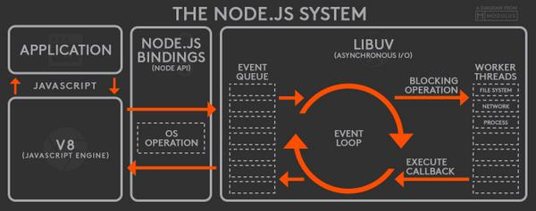

# 들어가기 전

다음과 같은 코드가 있다고 하자.
콘솔에는 어떻게 나타날까?

<div className='Image__Small'>
  
</div>

답은 '1 2 3 4 5 yes'다. <br />
왜 console.log를 0초 안에 뱉어내라고 `setTimeout()` 함수를 넣었는데도 불구하고 'yes'가 가장 늦게 콘솔에 찍힌 것일까?
이번 글에서는 자바스크립트가 비동기 처리를 하는 방식에 대해 알아보고 이벤트루프에 대해 정리해보고자 한다.

# 1. 자바스크립트가 비동기 처리를 하는 방식

## 1) 왜 비동기 처리를 해야하나

자바스크립트는 싱글스레드 언어다. <br />하나의 싱글 콜 스택만을 가지고 있다는 뜻이며, 자바스크립트의 엔진은 한 번에 하나의 태스크만 실행할 수 있다는 뜻이다. <br />
자바스크립트의 함수를 호출하면 함수 실행 컨택스트가 생성된다. 이때 생성된 함수 실행 컨텍스트는 콜 스택에 푸시되고 함수 코드가 실행된다. <br />
그리고 함수 코드의 실행이 끝나면 실행 컨텍스트 스택에서 팝되어 제거되는 방식이다.
이 과정은 스택 자료구조 기반으로 이뤄진 콜스택에 의해 동기적으로 이뤄진다.

```js
const sleep = (func, delay) => {
  const delayUntil = Date.now() + delay;
  while (Date.now() < delayUntil);
  func();
};

const foo = () => console.log('foo');
const bar = () => console.log('bar');

sleep(foo, 10 * 1000);
bar();
```

위의 `sleep()` 함수는 처리되는 데 10초가 걸린다. 그 다음 `bar()`함수는 10초 뒤에 동기적으로 실행된다. <br />
흔히 브라우저가 리페인트되고 렌더링될 때 1초에 60프레임을 리페인트 하는 게 이상적이고,
적당한 LCP(Largest contentful Paint) 시간이 2.5초라고 하는데 이런 블로킹이 생기면 사용자는 이 사이트가 느리다고 생각할 것이다. <br />
그 10초 동안의 `블로킹(작업 중단)`을 어떻게 막을 수 있을까?
(cf. 느린 동작이 스택에 남아있는 것을 보통 블로킹이라고 말한다.) <br />
이때 <u>비동기 처리</u>를 해주면 된다.

```js
const foo = () => console.log('foo');
const bar = () => console.log('bar');

setTimeout(foo, 10 * 1000);
bar();
```

콘솔에는 'bar'가 먼저 표시되고, 10초 뒤 'foo'가 나타난다.
이처럼 현재 실행 중인 태스크가 종료되지 않은 상태라 해도 다음 태스크를 곧바로 실행하는 방식이 비동기 처리다.

따라서 실행이 오래 걸리는 태스크를 처리해야할 때 발생하는 블로킹을 막고, 싱글스레드 언어인 자바스크립트의 동기적인 실행 컨택스트 스택을 벗어나 효율적으로 스케줄링하기 위해 비동기 처리를 사용한다.
`setTimeout()`, `setInterval()`, `HTTP request`, `DOM Event`는 모두 비동기 처리 방식으로 동작한다.
즉, API를 통해 Data를 받아오는 과정, Data를 서버에 업로드하는 과정, HTML 요소로 만든 애니메이션 효과 등은 모두 비동기적으로 처리되는 것이다.

<emphasizing>
  💡 <strong>console.log도 비동기다.</strong> <br />
  console.* 메서드는 공식적으로 자바스크립트의 일부분이 아니다. 정확히는 호스팅 환경에
  추가된 기능이다. 따라서 console.log 메소드는 브라우저의 유형과 상황에 따라 출력할
  데이터가 만들어진 직후에도 콘솔창에 바로 뜨지 않을 수도 있다. 브라우저가 console을
  비동기적으로 처리해야 성능상 유리하기 때문이다. 예상치 못한 결과값이 콘솔에 표시될
  때에는 콘솔의 실행 지연으로 인한 원인일 가능성도 염두에 두자.
</emphasizing>

## 2) 그렇다면 비동기는 어떻게 동작할까?

다시 한번 돌이켜보자. 자바스크립트 엔진은 싱글 스레드로 동작한다.
자바스크립트 엔진은 그저 요청하는 태스크를 순서대로 하나씩 처리하는 동기 처리 방식에 따라 움직일 뿐이다.
하지만 브라우저는 멀티 스레드로 동작한다. 그리고 자바스크립트 엔진은 반드시 호스팅(웹 브라우저, Node.js 서버) 환경에서 실행된다.

앞서 본 `setTimeout()` 예제 코드에서 foo와 bar 코드는 동시에 시작하는 것처럼 느껴진다.
우리가 흔히 보는 웹페이지에서도 이미지를 띄우면서 HTTP 요청으로 데이터를 전송하는 등 많은 것들이 동시에 일어나는 것처럼 보인다.
이렇게 여러 동작을 동시다발적으로 처리하는 `자바스크립트의 동시성`을 가능하게 하는 것. `동시성 처리 모델의 기본 원리`는 바로 `이벤트 루프`다.
따라서 비동기 처리를 위해서 비동기 코드의 평가와 실행은 자바스크립트 엔진이 담당하지만, 호출 스케줄링을 위한 함수의 등록은 호스팅 환경이 담당한다.
그리고 그 요청을 스케줄링하는 것이 `이벤트 루프`다.

## 3) 그렇다면 이벤트 루프는 어디에 있을까?

자바스크립트의 엔진을 살펴보자.
자바스크립트 엔진은 2개의 영역으로 이루어져 있다. `자바스크립트 = 콜 스택 + 메모리 힙`이다.

### 콜 스택

- 함수 등의 코드 평가 과정에서 생성된 실행 컨텍스트가 추가되고 제거되는 실행 컨텍스트 스택.
- 함수를 호출하면 함수 실행 컨텍스트가 순차적으로 콜 스택에 푸시되어 동기적으로 실행된다.

### 메모리 힙

- 객체가 저장되는 메모리 공간. 콜 스택의 요소인 실행 컨텍스트는 힙에 저장된 객체를 참조한다.
- 메모리 힙에는 자바스크립트 코드에서 정의한 여러 객체와 값이 저장된다.
- 객체는 원시값과는 달리 크기가 정해져 있지 않기 때문에 할당해야 할 메모리 공간의 크기는 동적 할당 된다. 즉 객체가 저장되는 메모리 힙은 구조화되어 있지 않다.

이게 전부다. 이벤트 루프는 자바스크립트 엔진에 있는 것이 아니다. (하지만.. ES6부터는 달라진다.. 3. Promise와 이벤트 루프에서 소개하겠다)
자바스크립트 엔진은 ECMAScript 스펙에 나와있는 표준에 따라 구현되었는데, ECMAScript에는 이벤트 루프에 대한 내용이 없다.
이벤트 루프는 자바스크립트 엔진을 둘러싼 `환경`에 있다.
바로 브라우저 혹은 Node.js 환경에서 태스크 큐와 이벤트 루프를 제공한다.

### 태스크 큐

- setTimeout이나 setInterval 과 같은 비동기 함수의 콜백 함수 또는 이벤트 핸들러가 일시적으로 보관되는 영역.
- 태스크 큐에 일시적으로 보관된 함수들은 비동기 처리 방식으로 동작한다.

### 이벤트 루프

- 콜 스택에 현재 실행 중인 실행 컨텍스트가 있는지, 그리고 태스크 큐에 대기 중인 함수가 있는지 반복해서 확인한다.
- 만약 콜 스택이 비어 있고 태스크 큐에 대기 중인 함수가 있다면 이벤트 루프는 순차적으로 태스크 큐에 대기 중인 함수를 콜 스택으로 이동시킨다.
- FIFO (First In First Out)

아래 그림을 보면서 실제로 이벤트 루프가 어디에 있는지 찾아보자.

### 브라우저 환경

<div className='Image__Small'>
  
</div>

### Node.js 환경

<div className='Image__Small'>
  
</div>

## 4) 비동기 처리 방식을 더 자세하게 풀어보자

간단한 예제를 들고왔다. (참고 - 모던자바스크립트 Deep Dive) <br />
아래의 함수는 어떻게 동작할까?
천천히 생각해보자.

```js
const foo = () => console.log('foo');
const bar = () => console.log('bar');

setTimeout(foo, 0);
bar();
```

(📌1) 전역 코드가 평가되어 전역 실행 컨텍스트가 생성되고 콜 스택에 push된다.<br />
(📌2) 전역 코드가 실행되기 시작하며 setTimeout 함수가 호출된다. 이때 setTimeout 함수의 함수 실행 컨텍스트가 생성되고 콜스택에 푸시되어 현재 실행 중인 실행 컨텍스트가 된다.<br />
브라우저의 Web API인 타이머 함수도 함수이므로 함수 실행 컨텍스트를 생성한다.<br />
(📌3) setTimeout 함수가 실행되면 `콜백 함수`를 호출 스케줄링하고 종료되어 콜 스택에서 pop된다.<br />
이때 호출 스케줄링, 즉 타이머 설정과 타이머가 만료되면 콜백 함수를 태스크 큐에 푸시하는 것은 `브라우저의 역할`이다.<br />
(📌4) 브라우저가 수행하는 4-1과 자바스크립트 엔진이 수행하는 4-2는 병렬로 처리된다.<br />
(📌4-1) 브라우저는 타이머를 설정하고 타이머의 만료를 기다린다.<br />
이후 타이머가 만료되면 콜백 함수 foo가 태스크 큐에 푸시된다. 위 예제의 경우 지연 시간이 0이지만, 지연 시간이 4ms 이하인 경우(eg.크롬 브라우저) 최소 지연 시간 4ms가 지정된다. <br />
따라서 4ms 후에 콜백 함수 foo가 태스크 큐에 푸시되어 대기하게 된다. 이 처리 또한 자바스크립트 엔진이 아니라 브라우저가 수행한다. <br />
이처럼 setTimeout 함수로 호출 스케줄링한 콜백 함수는 정확히 지연 시간 후에 호출된다는 보장은 없다. <br />
지연 시간 이후에 콜백 함수가 태스크 큐에 푸시되어 대기하게 되지만 콜 스택이 비어야 호출되므로 약간의 시간차가 발생할 수 있기 때문이다.<br />
(📌4-2) bar 함수가 호출되어 bar 함수의 함수 실행 컨택스트가 생성되고 콜 스택에 푸시되어 현재 실행 중인 실행 컨택스트가 된다. <br />
이후 bar 함수가 종료되어 콜 스택에서 pop된다. 이때 브라우저가 타이머를 설정한 후 4ms가 경과했다면 foo 함수는 아직 태스크 큐에서 대기 중이다.<br />
(📌5) 전역 코드 실행이 종료되고 전역 실행 콘텍스트가 콜 스택에서 팝된다. 이로서 콜 스택에는 아무런 실행 컨텍스트도 존재하지 않게 된다.<br />
(📌6) 이벤트 루프에 의해 콜 스택이 비어 있음이 감지되고 태스크 큐에서 대기 중인 콜백 함수 foo가 이벤트 루프에 의해 콜 스택에 push된다. 즉 콜백 함수 foo의 함수 실행 컨텍스트가 생성되고 콜 스택에 푸시되어 현재 실행 중인 실행 컨텍스트가 된다.<br />
이후 foo 함수가 종료되어 콜 스택에서 pop된다.<br />

setTimeout(foo, 0)이 바로 실행되지 않는 이유를 이젠 이해할 수 있다! <br />
그래도 이해가 되지 않는다면...
그 유명한 [Philip Roberts의 What the heck is the event loop](https://youtu.be/8aGhZQkoFbQ) 영상을 보고 오자!
([이 버전](https://vimeo.com/96425312)도 있다)

# 2. 이벤트 루프는 어떤 형태일까?

앞서 본 예제에서 setTimeout의 콜백 함수는 태스크 큐에 푸시되어 대기하다가 콜 스택이 비게 되면 비로소 콜 스택에 푸시되어 실행됐다.
이벤트 루프의 역할을 코드로 아주 간단하게 나타내어 보자면 다음과 같다.

```js
const eventLoop = []; // 이벤트 루프는 FIFO 특성을 지닌다.
const event = null;

while (true) {
  // 콜 스택이 비어있는지 계속 확인한다.
  if (eventLoop.length > 0) {
    event = eventLoop.shift(); // 먼저 들어온 것부터 스케줄링 한다.
    try {
      event(); // 이벤트 실행!
    } catch (err) {
      reportError(err);
    }
  }
}
```

MDN에서는 이벤트 루프를 아래와 같이 표현한다.

```js
while (queue.waitForMessage()) {
  queue.processNextMessage();
}
```

이벤트 루프는 매번 순회하면서 콜 스택이 깨끗한지 체크한다. 이걸 Tick이라고 한다.<br />
틱이 발생할 때마다 큐에 쌓여있는 이벤트(콜백 함수)를 꺼내어 실행한다.<br />
setTimeout()과 같은 함수는 타이머만 설정할 뿐, 타이머가 끝나면 환경이 콜백을 이벤트 루프에 삽입한 뒤 틱에서 콜백을 꺼내어 실행하는 것이다.<br />
setTimeout()에 인자로 넘긴 지연 시간이 지켜지지 않는 이유가 여기에 있다.
`setTimeout(()=>console.log, 0)`에서 0은 **보장된 시간이 아니라 요청을 처리하기 위해 필요한 최소의 시간**이다.
이벤트 루프는 '현재 실행중인 태스크가 없는지', '태스크 큐에 태스크가 있는지' 확인하며 매번 Tick하면서 기회를 엿보고 있을 것이다.

# 3. Promise와 이벤트 루프

자.. 이번엔 ES6부터 추가된 Promise를 살펴보자.
이제 우린 `setTimeout(foo, 0)` 같은 것들이 바로 실행되지 않는 이유를 알게되었다. <br />
하지만 Promise가 들어간 코드는 어떻게 실행될까?
다음 코드의 콘솔들이 어떤 순서로 찍힐지 한번 예상해보자.

```js
console.log('script start');

setTimeout(function() {
  console.log('setTimeout');
}, 0);

Promise.resolve()
  .then(function() {
    console.log('promise1');
  })
  .then(function() {
    console.log('promise2');
  });

console.log('script end');
```

답은 아래와 같다.

```
script start
script end
promise1
promise2
setTimeout
```

왜 setTimeout()의 콜백이 Promise 콜백보다 느리게 동작한 것일까?

### ES6 microtask queue

Microtask queue(혹은 Job queue)는 ES6에서 Promise와 함께 소개된 개념이다.
마이크로태스크 큐는 태스크 큐와는 다른 별도의 큐다. 마이크로태스크 큐를 사용하는 대표적인 함수가 Promise다.
기존의 태스크 큐 = 매크로태스크(Macrotask) 큐라고 한다.

<emphasizing>
  💡 <b>Macrotask queue를 이용하는 함수</b>
  <br />
  : setTimeout(), setInterval(), setImmediate(), requestAnimationFrame, I/O, UI
  렌더링
  <br />
  💡 <b>Microtask queue를 이용하는 함수</b>
  <br />: process.nextTick(), Promise, queueMicrotask
</emphasizing>

마이크로태스크 큐는 기존의 태스큐와 비교해서 보다 우선순위가 높다. <br />
따라서, 이벤트 루프는 콜 스택이 비면 먼저 마이크로태스크 큐에서 대기하고 있는 함수를 가져와서 실행한다.
그리고 마이크로태스크 큐가 빈 후에야 태스크 큐에서 대기하고 있는 함수를 가져와서 실행한다. <br />
아래 이미지를 보며 이해해보자.

<div className='Image__Small'>
  
  <a
    href='https://dev.to/lydiahallie/javascript-visualized-promises-async-await-5gke'
    target='_blank'
    rel='noopener'>
    이미지 출처에 다양한 사진들이 많다.
  </a>
</div>

따라서 정리해보자면,

- Macrotask queue (= task queue, message queue)
  - HTML 파싱, DOM 생성, 메인 스레드를 구성하는 JS code, 그리고 페이지 로드나 네트워크 이벤트, 타이머와 같은 여러 이벤트를 포함한다.
  - 지연 시간이 0초인 `setimeout()`으로 새로운 매크로태스크를 스케줄링 할 수 있다
- Microtask queue (= job queue)
  - Promise의 후속 처리 메서드의 콜백 함수를 처리한다.
  - 다른 이벤트 핸들링이나 렌더링 혹은 또 다른 매크로태스크가 실행되기 전에 완료된다.
  - 마이크로태스크는 바로 다음 마이크로태스크를 실행한다. 따라서 그 사이에는 UI 혹은 네트워크 변화가 없다. 
  - 브라우저가 리렌더 되기 전에 실행되므로, 마이크로태스크 큐의 작업이 늦게 처리된다면 브라우저의 UI 렌더링이 지연될 수 있다.

# 4. 마무리: 이벤트 루프를 막지 말자

```js
Think about async.
Don't block the event loop.
```

우선 event loop를 막지 않아야 한다.
스택에 필요없는 느린 코드를 쌓아서 브라우저가 할 일을 못하게 하지 말아야 한다.
예를 들어 콜스택에서 어떤 함수가 너무 오랫동안 실행되고 있으면 이벤트루프가 메시지큐를 확인하지 않는다.
그러면 함수의 동작이 길어져서 사용자가 화면을 클릭하더라도 이벤트가 발생하지 않고, 화면이 버벅이거나 심한 경우 동작하지 않는 문제가 발생한다.
따라서 함수의 단위는 작게 잘라서 작성해서 작성하는 것이 좋다.

또 너무 오래 걸리는 작업이 있다면 앞서 배운 `setTimeout(callback, 0)`과 같은 문법으로 지연시키는 방법도 있다.
태스크 큐로 callback을 넘겨주면서 적절하게 태스크를 분산시키는 것이다.

특히, 이미지 처리나 애니메이션이 너무 잦아졌을 때 큐 관리에 주의를 기울어야 한다.
이 경우 싱글 스레드인 자바스크립트의 단점을 보완해서 멀티스레딩을 가능하게 해주는 웹 워커 API를 활용하는 것도 방법일 수 있겠다.

<br /><br />


### 참고 자료

- NHNCloud | 자바스크립트와 이벤트 루프 https://meetup.toast.com/posts/
- MDN | 동시성 모델과 이벤트 루프 https://developer.mozilla.org/ko/docs/Web/JavaScript/EventLoop
- 이벤트 루프와 매크로·마이크로태스크 https://ko.javascript.info/event-loop
- Tasks, microtasks, queues and schedules https://jakearchibald.com/2015/tasks-microtasks-queues-and-schedules/
- JavaScript Visualized: Promises & Async/Await https://dev.to/lydiahallie/javascript-visualized-promises-async-await-5gke
- [자바스크립트 이벤트 루프: 마이크로태스크(Microtasks)와 매크로태스크(Macrotasks)](https://medium.com/official-podo/%EC%9E%90%EB%B0%94%EC%8A%A4%ED%81%AC%EB%A6%BD%ED%8A%B8-%EC%9D%B4%EB%B2%A4%ED%8A%B8-%EB%A3%A8%ED%94%84-%EB%A7%88%EC%9D%B4%ED%81%AC%EB%A1%9C%ED%83%9C%EC%8A%A4%ED%81%AC-microtasks-%EC%99%80-%EB%A7%A4%ED%81%AC%EB%A1%9C%ED%83%9C%EC%8A%A4%ED%81%AC-macrotasks-4563cdc324b0)
- 이웅모, <모던 자바스크립트 Deep Dive>
- 카일 심슨, <You Don't know JavaScript>
