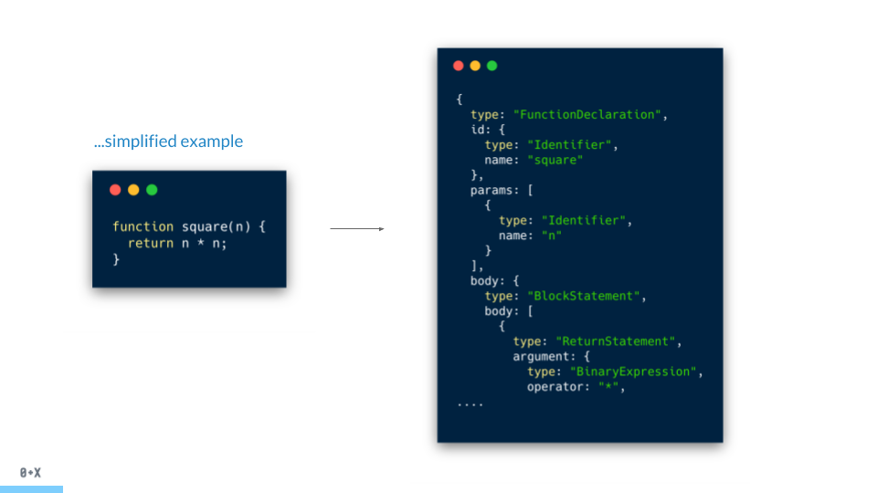
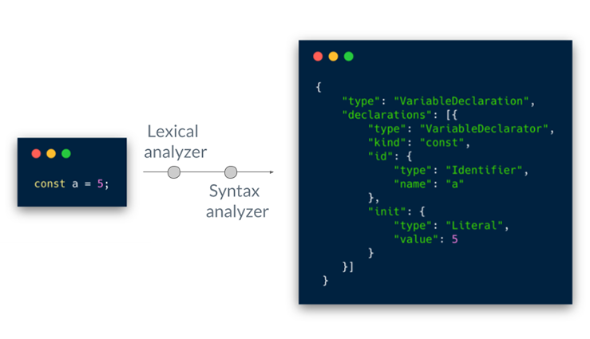

이 글에서는 스코프를 다음과 같은 순서로 설명할 것이다.

1) 스코프 2) 렉시컬 스코프 3) 함수와 블록 스코프
그리고 이 글은 다음 글 '호이스팅'에 이어진다.

# 1. 스코프란

스코프란 식별자가 유효한 범위다.
어떤 경계가 있다고 하자. 이 경계 밖에서 선언한 a 변수는 경계 안팎으로 접근 가능하다.
하지만 경계 안에서 선언한 a 변수는 오직 경계 안에서만 접근 가능하다.

변수는 **자신이 선언된 위치를 기준**으로 본인이 유효한 범위가 결정된다.
즉 모든 식별자는 선언된 위치에 의해 다른 코드가 본인을 참조할 수 있는 유효 범위(스코프)가 결정된다.

```js
var name = 'edie';

function sayName() {
  var name = 'meng';
  console.log(name); // meng
}
sayName();

console.log(name); // edie
```

위의 코드에서 글로벌에서 선언된 'edie'는 어디서든 참조할 수 있다.
하지만 sayName함수 내부에서 선언된 name 변수는 sayName 함수 내부에서만 참조할 수 있다.
따라서 둘의 scope는 다르다.
여기서 전역 스코프와 지역 스코프의 개념을 알 수 있다.
sayName() 함수 안은 **지역 스코프**, 그 밖은 **전역 스코프**라고 할 수 있다.
그리고 지역 변수는 본인의 지역 스코프와 하위 지역 스코프에서 유효하다.

이런 스코프의 경계는 여러 언어에 존재한다.
다만 ES5까지의 자바스크립트는 이러한 경계를 **함수에 의해서만** 생성할 수 있었다.
ES6부터는 블록에 의해서도 스코프 경계가 생성되면서 다른 언어와 비슷하게 되었다.
이러한 블록도 var로 선언된 변수에 대해서는 작용하지 않고 새로 생긴 let과 const, class, strict mode에서의 함수 선언 등에 대해서만 적용된다.
ES6부터는 이 둘을 구분하기 위해 함수 스코프, 블록 스코프라는 용어를 사용한다.

## 스코프 규칙이 만들어지는 과정

이런 스코프 규칙은 어떻게 정해지는 걸까?

이 과정을 알기 위해서는 자바스크립트가 'JIT 컴파일링 언어'라는 사실을 먼저 짚고 넘어가야 한다.
자바스크립트는 우선 '인터프리터 언어' 방식으로 실행하고 필요할 때 컴파일 과정을 거친다. 이 방식을 JIT 컴파일링이라고 부른다.
컴파일러 언어가 컴파일링되는 과정은 크게 3단계로 1) 토크나이징 / 렉싱 2) 파싱 3) 코드 생성 순서로 진행된다.
그리고 자바스크립트의 컴파일링은 자바스크립트의 엔진이 담당한다.
크롬 브라우저의 V8엔진, 사파리 브라우저의 JavaScript Core엔진 등은 모두 자바스크립트를 JIT 컴파일링한다.

#### 1) 토크나이징 / 렉싱

코드를 읽어들여서 하나의 의미 있는 Token 단위로 조각내는 과정이다.
`const a = 1;`이라는 코드가 있을 때 자바스크립트 엔진은 이 코드를 다음과 같이 5조각으로 분해한다.
`const / a / = / 1 / ;` 가장 작지만 문법적인 의미가 있는 토큰 조각으로 분해된 모습이다.

#### 2) 파싱

파싱은 쪼개진 토큰을 **컴파일러**가 프로그램의 문법 구조를 반영해서 트리 형태로 바꾸는 과정이다.
이 파싱의 결과로 만들어진 트리를 **AST(Abstract Syntax Tree 추상 구문 트리)**라고 한다.
아래 그림을 보자. 간단한 JavaScript 코드가 AST로 만들어진 결과물이다. (이미지 출처)[https://itnext.io/ast-for-javascript-developers-3e79aeb08343]

<div className='Image__Small'>
  
</div>

자세히 보자. square()라는 함수가 FunctionDeclaration 안에 id와 params, body로 나뉘어 트리 형태로 표현되었다.
아래 그림은 `const a = 5;`의 AST 결과물이다.

<div className='Image__Small'>
  
</div>

#### 3) 코드 생성

토크나이징되고 AST로 만들어진 코드는 실행 코드로 컴파일링 된다.
이 부분은 언어에 따라 혹은 플랫폼에 따라 다르다.
자바스크립트는 이 과정에서 다른 언어의 컴파일링보다 더 복잡한 과정을 거친다(JIT).
JIT 컴파일이란 언어의 컴파일링을 실제 실행하는 시점에(Just In Time) 번역하는 컴파일링 기법이다.

이 3단계의 과정을 통해 다음과 같이 스코프가 만들어진다.

`var a = 2`라는 코드가 있다고 하자.
(1) 컴파일러가 var a를 만나면 스코프에게 변수 a가 스코프에 있는지 묻는다.
변수 a가 이미 있다면 컴파일러는 선언을 무시하고 지나가고, 그렇지 않으면 컴파일러가 새로운 변수 a를 스코프 컬렉션 내에 추가하라고 요청한다.
(2) 그 후 컴파일러는 a = 2를 처리하기 위해 엔진이 실행할 수 있는 코드를 작성한다.
엔진이 실행하는 코드는 먼저 스코프에게 a라 부르는 변수가 현재 스코프 내에서 접근할 수 있는지 확인한다.
가능하다면 엔진은 a를 사용하고, 아니면 바로 다음 바깥의 스코프를 살펴본다.
(3) 만약 다른 스코프에서 변수를 찾으면 변수에 값 2를 넣고, 못 찾으면 계속 다음 바깥의 스코프로 넘어가다가 글로벌 스코프에서도 못 찾는다면 엔진은 'reference error'를 발생시킨다.

<emphasizing>
  📌 RHS, LHS - RHS (Right-Hand Side) 참조: console.log(a)에서 a의 값을 찾는
  참조 - LHS (Left-Hand Side) 참조: var a = 2에서 a의 값을 찾는 참조 RHS 참조가
  대상을 찾지 못하면 referenceError 발생한다. LHS 참조가 대상을 찾지 못하면
  암시적으로 글로벌 스코프에 같은 이름의 새로운 변수가 생성된다. 하지만 Strict
  모드일 경우에는 똑같이 referenceError가 발생한다.
</emphasizing>

## 스코프 체인

앞서 이야기한 것처럼 변수를 참조할 때 자바스크립트 엔진은 실행 코드의 스코프에서 시작해서 계속 바깥의 상위 스코프로 이동하며 변수를 검색했다.
'식별자 유효범위'를 안에서부터 바깥으로 차례로 검색해나가는 것을 **스코프 체인**이라고 한다.
스코프 체인은 실행 컨텍스트의 렉시컬 환경을 단방향으로 연결한 것이다. 이 연결은 LexicalEnvironment의 두 번째 수집 자료인 outerEnvironmentReference를 통해 이뤄진다.

여기서 중요한 규칙은 상위 스코프의 변수는 하위 스코프에서 접근할 수 있지만, 하위 스코프에서 선언한 식별자는 상위에서 참조할 수 없다는 것이다.

# 2. 렉시컬 스코프

어떤 함수가 어디서 또는 어떻게 호출되는지에 상관없이 함수의 렉시컬 스코프는 **함수가 선언된 위치**에 따라 정의된다.
렉시컬 환경의 outerEnvironmentReference에 저장할 참조값, 즉 상위 스코프에 대한 참조는 함수 정의가 평가되는 시점에
함수가 정의된 환경(위치)에 의해 결정된다. 이것이 바로 렉시컬 스코프다.

## [[Environment]] 

앞선 글 [실행 컨텍스트](https://positiveko.netlify.app/javascript-execution-context)에서 LexicalEnvironment와 variableEnvironment에는
environmentRecord와 outerEnvironmentReference라는 속성이 있다고 했다.
특히 environmentRecord에는 변수와 함수가 저장이 된다. 그리고 outerEnvironmentReference에는 현재 스코프보다 바깥에 있는 environmentRecord를 참고한다.
아래 코드를 보자

```js
const author = 'edie';
console.log(author);

function say() {
  const name = 'meng';
  console.log(name);
  console.log(author);
}
say();
```
say()라는 함수는 함수가 정의된 환경과 호출되는 환경이 다를 수 있기 때문에, 자신이 호출되는 환경과는 상관없이 자신이 정의된 환경, 즉 상위 스코프를 기억해야 한다.
따라서 함수는 [[Environment]]에 자신이 정의된 환경, 즉 상위 스코프의 참조를 저장한다.
이때 [[Environment]]는 현재 실행 중인 실행 컨텍스트의 렉시컬 환경을 가리킨다. 따라서 [[Environment]]가 곧 상위 스코프라고 보면 된다.
또한 이것은 say()라는 함수가 호출되었을 때 생성될 LexicalEnvironment의 outerEnvironmentReference에 저장될 값이다.

# 3. 함수와 블록 레벨 스코프

앞서 이야기했던 문장을 다시 꺼내보자.
ES5까지의 자바스크립트는 이러한 경계를 **함수에 의해서만** 생성할 수 있었다.
ES6부터는 블록에 의해서도 스코프 경계가 생성되면서 다른 언어와 비슷하게 되었다.
이러한 블록도 var로 선언된 변수에 대해서는 작용하지 않고 새로 생긴 let과 const, class, strict mode에서의 함수 선언 등에 대해서만 적용된다.
ES6부터는 이 둘을 구분하기 위해 함수 스코프, 블록 스코프라는 용어를 사용한다.

## 1) 함수 레벨 스코프

var로 선언된 변수는 오로지 함수의 코드 블록만을 지역 스코프로 인정한다. 이러한 특성을 함수 레벨 스코프라 한다.

```js
var i = 10;
// var로 선언된 i는 전역 변수
for (var i = 0; i < 5; i++) {
  console.log(i);
}
console.log(i); // 5
```

위의 코드에서 for문 안에 선언된 i는 var로 선언되었기 때문에 전역 변수가 된다. 따라서 마지막 줄의 console에는 5가 나온다.
즉, var 키워드로 선언된 변수는 오로지 함수의 코드 블록만을 지역 스코프로 인정한다.
또한 var로 변수를 선언하면 변수 호이스팅에 의해 변수 선언이 스코프의 상위로 끌어 올려진 것처럼 작용한다.
따라서 var로 선언한 변수는 선언 이전에 미리 참조할 수 있다.

```js
// 변수 호이스팅에 의해 이미 foo 변수가 선언되었다.
// 변수 foo는 undefined로 초기화된다.
console.log(b); // undefined
// 변수에 값 할당
b = 123;
console.log(b); // 123
// 변수 선언은 런타임 이전에 자바스크립트 엔진에 의해 암묵적으로 실행된다.
var b;
```

이러한 방식으로 var로 선언한 변수는 전역 변수가 되어 전역 객체의 프로퍼티가 된다.
이 뜻은 전역 변수의 문제점을 쉽게 야기할 수 있다는 뜻이다. (암묵적 결합, 긴 생명 주기, 검색 속도 느림, 네임스페이스 오염)
이러한 var의 특성으로 인해서 기존에는 즉시호출함수(IIFE)를 사용하거나 모듈로 숨기는 방식으로 단점을 극복했다.
하지만 var가 아닌 let, const로 선언해서 블록 레벨 스코프를 사용하도록 하는 것이 좋다.

## 2) 블록 레벨 스코프

let과 const로 선언한 변수는 모든 코드 블록을 지역 스코프로 인정하는 블록 레벨 스코프를 따른다.
다음 예제를 보자.

```
let foo = 1;
{
  let foo = 2;
  let bar = 3;
}
console.log(foo); // 1
console.log(bar); // ReferenceError: bar is not defined
```

## 참고 자료

- [AST for JavaScript developers](https://itnext.io/ast-for-javascript-developers-3e79aeb08343)
- [자바스크립트 개발자를 위한 AST(번역)](https://gyujincho.github.io/2018-06-19/AST-for-JS-devlopers)
- [JavaScript, 인터프리터 언어일까?](https://oowgnoj.dev/review/advanced-js-1)
- 이웅모, <모던 자바스크립트 Deep Dive>
- 카일 심슨, <You don't know JS>
